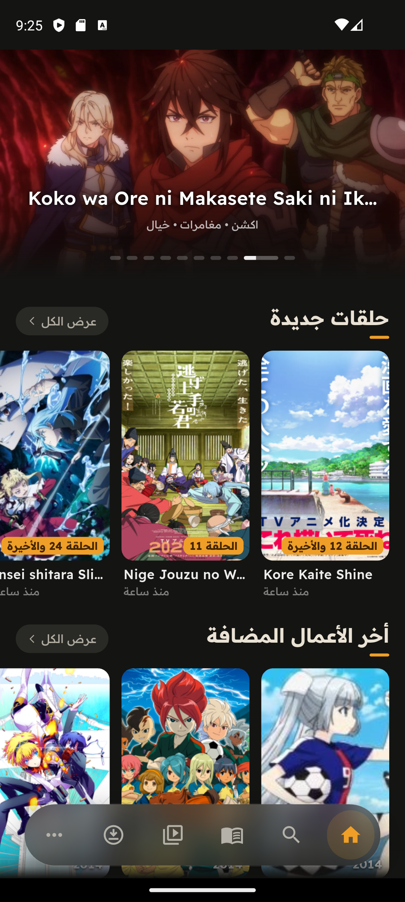
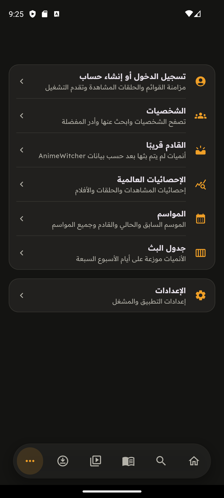
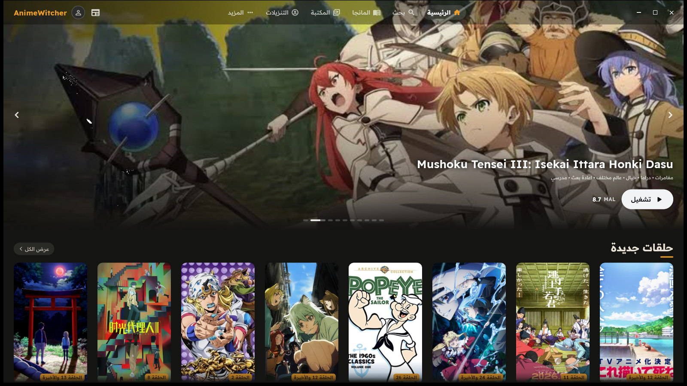
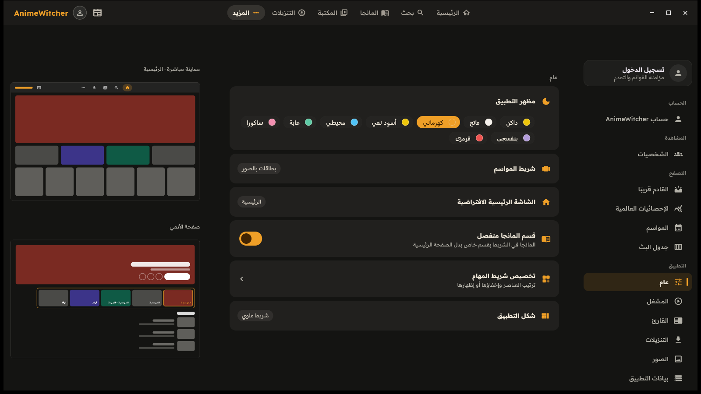

<div align="center">

# AnimeWitcher

**تطبيق أنمي عربي لمشاهدة الحلقات وتحميلها، مبني بـ Flutter ويعمل على الهاتف والحاسب والتلفاز.**

  <a href="https://github.com/Fares669/AnimeWitcher/releases">
    
  </a>
  <a href="https://github.com/Fares669/AnimeWitcher/stargazers">
    
  </a>
  <a href="https://github.com/Fares669/AnimeWitcher/releases">
    
  </a>
  <a href="https://github.com/Fares669/AnimeWitcher/issues">
    
  </a>
  <a href="https://github.com/Fares669/AnimeWitcher/commits/main">
    
  </a>

</div>

<div dir="rtl">

## عن التطبيق

**AnimeWitcher** تطبيق مفتوح المصدر لمشاهدة الأنمي بالعربية. يعرض مكتبة [animewitcher.com](https://animewitcher.com) داخل واجهة عربية كاملة الاتجاه من اليمين إلى اليسار، ويشغّل الحلقات في مشغّل مدمج، ويحفظ قوائمك وتقدّم مشاهدتك في حسابك لتنتقل معك بين أجهزتك.

المصدر مدمج في التطبيق ولا يحتاج إلى إضافات أو إعدادات: تفتحه وتشاهد. وواجهة واحدة مبنية بـ Flutter تخدم الهاتف والحاسب والتلفاز، فكل منصّة تحصل على التخطيط الذي يناسب شاشتها وطريقة التحكم بها.

> **تنبيه:** التطبيق عميل بث فقط ولا يستضيف أي محتوى. كل ما يُعرض فيه يأتي من مصادر خارجية، والمشروع لا يشجّع على انتهاك حقوق النشر.

## لقطات من التطبيق

#### 📱 الهاتف

<p align="center">
  
  
</p>

#### 🖥️ الحاسب

<p align="center">
  
</p>

<p align="center">
  
</p>

<p align="center">
  
</p>

## المميزات

### 🏠 التصفّح والاكتشاف

- **الرئيسية** – عرض مميّز متحرّك، الحلقات الجديدة، وآخر الأعمال المضافة.
- **المواسم** – الموسم السابق والحالي والقادم، وأرشيف المواسم كاملًا.
- **جدول البث** – الأنميات موزّعة على أيام الأسبوع السبعة.
- **القادم قريبًا** – أعمال لم تُبَث بعد.
- **الإحصائيات العالمية** – ترتيب MyAnimeList: أفضل الأنميات، المستمرة، الأفلام، المسلسلات، OVA، وONA.
- **الشخصيات** – تصفّح الشخصيات والبحث عنها وإدارة المفضّلة منها.
- **البحث** – بحث فوري داخل المكتبة، مع **عمليات البحث الأخيرة** تظهر عند فتح الصفحة لتعيد أي بحث بلمسة.

### 👤 الحساب والمزامنة

- **تسجيل الدخول بحساب Google** – أو استخدام التطبيق بلا حساب.
- **مكتبة مزامَنة** – المفضلة، أشاهده حاليًا، أكملها لاحقًا، أرغب بمشاهدته، تمت مشاهدته، لا أرغب بمشاهدته.
- **تقدّم المشاهدة** – الحلقات المشاهَدة وموضع التوقّف ينتقلان بين أجهزتك.
- **التقييمات والتعليقات** – قيّم الأعمال، واكتب التعليقات والردود.
- **الملف الشخصي** – صورة شخصية، شخصيات مفضّلة، وإعدادات خصوصية (منها إخفاء محتوى الإيتشي).

### ▶️ المشغّل

- مبني على **media_kit** مع فك ترميز بالعتاد.
- **استئناف التشغيل** من حيث توقّفت.
- تحكّم بـ **سرعة التشغيل**، و**أوضاع ملء الشاشة**، و**عمق التخزين المؤقت**، و**مدّة التقديم والتأخير**.
- **إيماءات** السطوع ومستوى الصوت، ووضع **صورة داخل صورة (PiP)**.
- **لوحة الحلقات داخل المشغّل** مع بحث برقم الحلقة — مفيد في الأعمال الطويلة التي تتجاوز ألف حلقة.
- **بطاقة الحلقة التالية**، مع تحضير مصادر الحلقة التالية مسبقًا كخيار.
- **تشغيل عبر مشغّل خارجي** إن فضّلته على المشغّل المدمج.
- **Anime4K** – ترميم الصورة وتكبيرها على كرت الشاشة أثناء التشغيل، مع اختيار النمط (A / B / C وتضاعفاتها) وحجم الشبكة (S حتى UL).

<details>
<summary><b>✨ تشغيل Anime4K</b></summary>

<br>

ملفات Anime4K غير مضمّنة في التطبيق — هي مشروع منفصل بترخيص MIT — لذا تُنزَّل مرة واحدة ثم يُشار إلى مجلدها:

1. نزّل ملفات `.glsl` من [مشروع Anime4K](https://github.com/bloc97/Anime4K/releases) وضعها في مجلد واحد.
2. من **الإعدادات ← المشغّل ← Anime4K** اختر المجلد، ثم النمط وحجم الشبكة.
3. يعرض التطبيق عدد الملفات التي وجدها، ويسمّي الناقص منها إن وُجد.

| | |
|:--|:--|
| **A** | للمصادر المضغوطة — وهي أغلب ما يُبَث |
| **B** | ترميم أخف، حين يبالغ النمط A في الحدة |
| **C** | للمصادر النظيفة أصلًا |
| **A+A / B+B / C+A** | تمريرة ترميم إضافية — أبطأ، للمصادر السيئة |

> يعمل مع المشغّل المدمج (mpv) فقط، ولا يعمل مع المشغّل المستخدم لبعض البثوث المحمية. وكل درجة أعلى في حجم الشبكة تضاعف تقريبًا الحِمل على كرت الشاشة، فابدأ بـ S على الهاتف.

</details>

<details>
<summary><b>⌨️ اختصارات لوحة المفاتيح في المشغّل (الحاسب)</b></summary>

<br>

| المفتاح | الوظيفة |
|:--|:--|
| `مسافة` أو `K` | تشغيل وإيقاف — ومع الاستمرار بالضغط على المسافة يعمل بسرعة ٢× |
| `←` `→` أو `J` `L` | تأخير وتقديم بالمدّة المضبوطة في الإعدادات |
| `↑` `↓` | رفع وخفض الصوت |
| `0` – `9` | الانتقال إلى ذلك العُشر من الحلقة |
| `,` `.` | خفض ورفع سرعة التشغيل بمقدار ربع |
| `M` | كتم الصوت |
| `F` | ملء الشاشة |
| `Z` | تغيير أبعاد الصورة |
| `Esc` | الخروج من ملء الشاشة، أو إغلاق اللوحة المفتوحة |

</details>

### ⏭️ تخطّي المقدمة والنهاية والفلر

- توقيتات من **AniSkip** و**IntroDB**، مع ربط المعرّفات عبر **ani.zip** للوصول إلى قواعد بيانات لا تعرف معرّفات الأنمي أصلًا.
- **تخطّي حلقات الفلر** بثلاثة أوضاع: إيقاف، أو تنبيه مع زر تخطٍّ، أو تخطٍّ تلقائي.

### ⬇️ التنزيلات

- **تنزيل متوازٍ متعدّد الأجزاء** مع تحكّم بعدد المهام وعدد الأجزاء.
- **إشعارات التقدّم** ومتابعة التنزيل في الخلفية.
- **مشاهدة دون اتصال** مع مزامنة سجلّ المشاهدة للحلقات المحمَّلة.

### 🎨 الواجهة

- **عربية بالكامل** باتجاه RTL.
- **مظهر داكن أو فاتح أو حسب النظام**.
- **تخصيص شريط المهام** — ترتيب العناصر وإخفاؤها، واختيار الشاشة الافتتاحية.
- **تخطيط بلوحتين** على الحاسب واللوحي، وتخطيط لوحة واحدة على الهاتف.
- **دعم التنقّل بالريموت (D-pad)** على التلفاز.

## المنصات المدعومة

| المنصة          |          الدعم           |
|:----------------|:------------------------:|
| **أندرويد**     |            ✅             |
| **أندرويد تي في** |            ✅             |
| **iOS**         | ✅ (يتطلّب Sideloading)   |
| **ويندوز**      |            ✅             |
| **ماك**         |            ✅             |

## 📥 التثبيت

نزّل أحدث إصدار من **[صفحة الإصدارات](https://github.com/Fares669/AnimeWitcher/releases/latest)**.

### 🤖 أندرويد / أندرويد تي في

1. نزّل ملف `.apk` المناسب لجهازك: نسخة `arm64-v8a` لمعظم الهواتف الحديثة، ونسخة `armeabi-v7a` لأجهزة التلفاز والأجهزة الأقدم.
2. افتح الملف واضغط **تثبيت**.
   - *قد تحتاج إلى السماح بالتثبيت من "مصادر غير معروفة" في إعدادات المتصفّح.*

### 🍏 iOS (Sideloading)

التطبيق غير متوفّر على App Store، ويُثبَّت عبر **Sideloading** من حاسب.

**المتطلبات:**
- حاسب ويندوز أو ماك.
- [Impactor](https://impactor.khcrysalis.dev/) (مجاني ومفتوح المصدر) أو [Sideloadly](https://sideloadly.io/) (مجاني).
- [iTunes](https://support.apple.com/en-us/106372) إذا كنت على ويندوز.

**الخطوات:**
1. نزّل ملف `.ipa` من [صفحة الإصدارات](https://github.com/Fares669/AnimeWitcher/releases/latest).
2. افتح **Impactor** أو **Sideloadly** على الحاسب.
3. وصّل الآيفون أو الآيباد عبر USB.
4. اسحب ملف `.ipa` إلى نافذة البرنامج.
5. أدخل **Apple ID** في الحقل المخصّص له، ثم اضغط **Start**.
6. بعد انتهاء التثبيت، افتح **الإعدادات > عام > إدارة VPN والأجهزة**، اضغط على بريدك، ثم اختر **الوثوق**.

**أدلّة مصوّرة:** [دليل Impactor](https://impactor.khcrysalis.dev/docs/getting-started/installing/) — [شرح Sideloadly بالفيديو](https://www.youtube.com/watch?v=vqTsavQc3lQ)

### 💻 ويندوز / ماك

1. نزّل الملف المناسب لنظامك (`.exe` لويندوز، `.dmg` للماك).
2. ثبّت التطبيق وشغّله.
   - *على الماك: إن ظهرت رسالة "مطوّر غير معروف"، افتح **الإعدادات → الخصوصية والأمان** واضغط **Open Anyway** مرة واحدة.*

## 🛠️ البناء من المصدر

</div>

```bash
git clone https://github.com/Fares669/AnimeWitcher.git
cd AnimeWitcher
flutter pub get
flutter gen-l10n
dart run build_runner build --delete-conflicting-outputs
flutter run
```

<div dir="rtl">

تفاصيل تهيئة البيئة والبناء لكل منصّة وبنية المشروع موجودة في دليل المساهمين: **[CONTRIBUTING.md](docs/CONTRIBUTING.md)**

### مبني بـ

</div>

   

<div dir="rtl">

## 🤝 المساهمة

كل مساهمة مرحّب بها، سواء كانت إصلاح خلل أو إضافة ميزة أو تحسين الترجمة.

- **وجدت مشكلة؟** أبلغ عنها في صفحة **[GitHub Issues](https://github.com/Fares669/AnimeWitcher/issues)**.
- **تريد المساعدة في الترجمة؟** راجع **[دليل الترجمة](docs/CONTRIBUTING_TRANSLATIONS.md)**.
- **تحتاج مساعدة؟** انضم إلى المجتمع على **[ديسكورد](https://discord.gg/73XGA8Mxn9)**.

## ❓ الأسئلة الشائعة

<details>
<summary><b>هل أحتاج إلى حساب لاستخدام التطبيق؟</b></summary>
<br>
لا. يمكنك التصفّح والمشاهدة والتحميل من دون تسجيل دخول. الحساب يضيف المزامنة بين الأجهزة، والمكتبة، والتقييمات، والتعليقات، والشخصيات المفضّلة.
</details>

<details>
<summary><b>أين يُخزَّن المحتوى؟</b></summary>
<br>
لا يستضيف AnimeWitcher أي محتوى. التطبيق عميل بث يعرض ما توفّره المصادر الخارجية.
</details>

<details>
<summary><b>لماذا لا تظهر مؤقّتات تخطّي المقدمة في بعض الحلقات؟</b></summary>
<br>
لأن التوقيتات تأتي من قواعد بيانات مجتمعية (AniSkip وIntroDB)، ولا تحتوي كل حلقة على مساهمة فيها. تظهر البطاقة عند توفّر توقيت للحلقة فقط.
</details>

<details>
<summary><b>هل يدعم التطبيق لغات أخرى؟</b></summary>
<br>
الواجهة عربية حاليًا. المشروع يستخدم ملفات ARB القياسية في <code>lib/l10n</code>، فإضافة لغة جديدة ممكنة عبر دليل الترجمة أعلاه.
</details>


</div>

## ⭐ تاريخ النجوم

</div>

<a href="https://www.star-history.com/#Fares669/AnimeWitcher&Date">
 <picture>
   <source media="(prefers-color-scheme: dark)" srcset="https://api.star-history.com/svg?repos=Fares669/AnimeWitcher&type=date&theme=dark" />
   <source media="(prefers-color-scheme: light)" srcset="https://api.star-history.com/svg?repos=Fares669/AnimeWitcher&type=Date" />
   
 </picture>
</a>

<div dir="rtl">

## 👥 المساهمون

</div>

<a href="https://github.com/Fares669/AnimeWitcher/graphs/contributors">
  
</a>

<div dir="rtl">

## 📄 الترخيص

[MIT](LICENSE)

</div>
